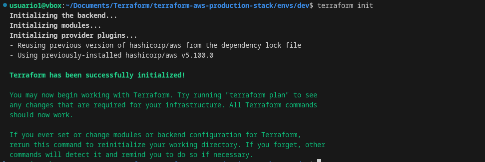
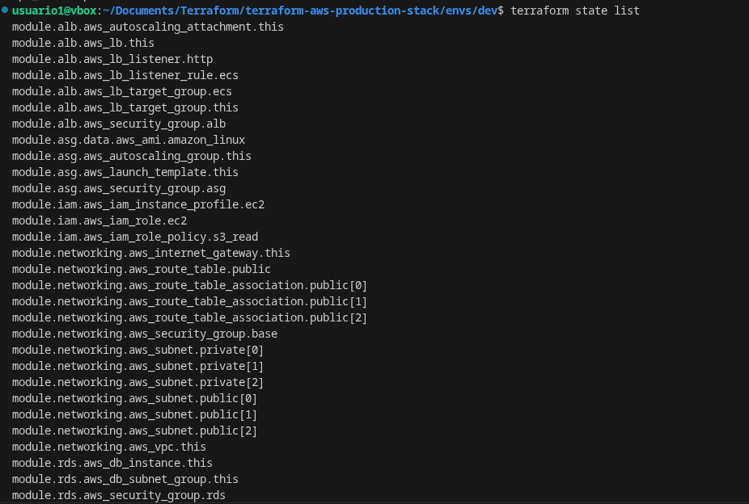
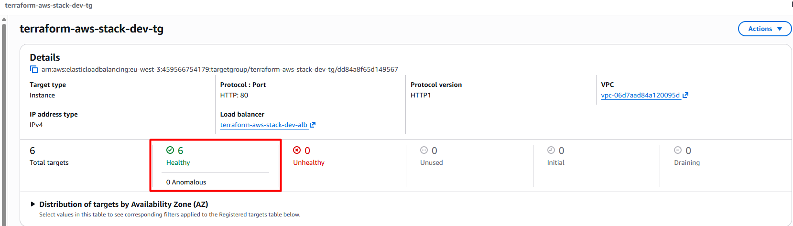
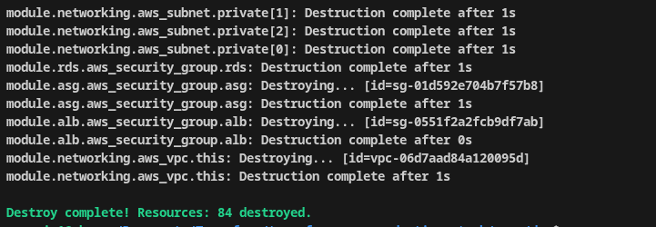

# 🚀 AWS Production Infrastructure - Terraform

> Production-ready AWS infrastructure with Terraform

Cloud architecture deployed on AWS using Terraform, designed for high availability and scalability.

Includes a VPC with public and private subnets, load balancing, and layered security controls.
Implements infrastructure-as-code principles, modularity, and deployment automation.
Prepared to run containerized platforms and Kubernetes environments.
Integrates cloud security, networking, and resilience best practices.
Built as a solid foundation for production environments and modern DevOps teams.

[](https://www.terraform.io/)
[](https://aws.amazon.com/)


[](https://github.com/luisrodvilladaorg/terraform-aws-production-stack/commits/main)
[](LICENSE)


---

## 💼 Recruiter TL;DR

- **Infrastructure as Code (IaC):** Production-ready AWS infrastructure built with Terraform using reusable modules (VPC, ALB, ASG, RDS, IAM, S3, CloudWatch).
- **High Availability Architecture:** Multi-tier architecture on Amazon Web Services with Load Balancer + Auto Scaling for resilience and horizontal scaling.
- **Secure Networking Design:** Custom VPC with public/private subnets, security groups, and least-privilege IAM roles.
- **Modular Terraform Structure:** Clean module-based design (`modules/`, `envs/dev`, `envs/prod`) following real production patterns.
- **Observability & Logging:** Integrated monitoring using CloudWatch metrics and logging.
- **Full-stack Deployment:** Static frontend hosted on S3 and backend service deployed on scalable infrastructure.

---

## 🎯 Key Features

- ✅ **Multi-AZ High Availability** - Distributed across 3 availability zones with automatic failover
- ✅ **Automatic Scaling** - Auto Scaling Group with CPU/Memory metrics (1-3 instances)
- ✅ **Private Database Layer** - PostgreSQL RDS Multi-AZ isolated in private subnets
- ✅ **Load Balancing** - Application Load Balancer with health checks and dynamic targets
- ✅ **Modular Design** - 8 reusable and independent Terraform modules
- ✅ **Defense in Depth** - Least-privilege IAM, security groups, encrypted state with S3+SSE
- ✅ **Cost Optimized** - ~$81.50/month for production, with Spot instance options

---

## 🏢 Provisioned Infrastructure

### 🎯 Architectural Design and Philosophy

This solution implements a **three-tier architecture pattern (3-tier)**, an industry standard that provides:

✨ **Separation of responsibilities** - Each layer has its own security domain  
🔐 **Defense in depth** through component isolation  
📈 **Horizontal scalability** without affecting stability or dependencies  
🔧 **Full modularity** - Reusable components across projects  
🖥️ **Granular control** - Per-layer customization without impacting other layers  

Each Terraform module is **fully independent** with well-defined inputs/outputs, enabling reuse, isolated testing, and simplified maintenance.

### 📋 Implemented Resources by Layer

**Network Layer (Networking):**
- **VPC** 10.0.0.0/16 across 3 AZs
- **Internet Gateway** for incoming public traffic
- **Segmented Route Tables** (public/private)

**Access Layer (Subnets):**
- **3 Public Subnets** (10.0.1.0/24, 10.0.2.0/24, 10.0.3.0/24) for ALB
- **3 Private Subnets** (10.0.101.0/24, 10.0.102.0/24, 10.0.103.0/24) for applications
- **Security Groups** with least-privilege rules

**Application Layer (Compute):**
- **Application Load Balancer** with health checks (port 80/443)
- **Auto Scaling Group** of EC2 t3.micro instances (1-3 instances)
- **Versioned Launch Template** with Amazon Linux 2 AMI

**Data Layer (Database):**
- **RDS PostgreSQL** Multi-AZ with automatic backups
- **DB Subnet Group** for database isolation

**Storage and Security Layer:**
- **S3 Buckets** for ALB logs and static site hosting
- **IAM Roles & Policies** with granular permissions
- **CloudWatch** for logs and monitoring (ready)

---

## 🔄 CI/CD Integration

**Status:** 🚧 Ready for implementation (structure in place)

This infrastructure is built for **modern DevOps** with automated testing, validation, and deployments. The repository includes ready-to-use GitHub Actions workflows.

### GitHub Actions Pipeline (Recommended Configuration)

**On Pull Requests:**
- ✔️ `terraform fmt` - Format validation
- ✔️ `terraform validate` - Syntax validation
- ✔️ `terraform plan` - Change plan with comments
- 🔐 Security scanning (tfsec, checkov)
- 📊 Cost estimation preview

**On Merge to `main`:**
- ✅ Auto-apply in dev environment (with manual approval)
- 📧 Notifications of applied changes
- 💾 Automatic state backup to S3

**For Production:**
- 🔐 Manual approval required with reviewed-by
- 📝 Automatic changelog from commits
- ↩️ Pre-calculated rollback plan

---

## 📸 Screenshots

### Terraform Initialization


*Complete Terraform project initialization with AWS providers, modules, and remote backend configuration download. This step prepares the workspace to manage infrastructure as code.*

---

### Deployed Resource State


*Complete list of 80+ AWS resources created. It demonstrates centralized infrastructure state management, enabling tracking of each component from VPC, subnets, ALB, ASG, RDS, and IAM policies.*

---

### Running EC2 Instances


*Visualization of active EC2 t3.micro instances in running state in the AWS Console. It demonstrates a correctly functioning Auto Scaling Group with health monitoring and multi-AZ distribution.*

---

### Auto Scaling in Action


*Auto Scaling Group metrics charts showing automatic scaling based on CPU and memory. It visualizes how infrastructure dynamically adapts to load, from 1 to 3 instances based on demand.*

---

### Controlled Infrastructure Teardown


*Controlled execution of `terraform destroy`, demonstrating the ability to fully dismantle AWS infrastructure. It shows how all resources can be safely and audibly released with a single command.*

---

### 📷 [See more deployment screenshots →](docs/SCREENSHOTS.md)

---

## 🌍 Deployment Environments

The infrastructure supports multiple environments with specific configurations:

### Development Environment (dev) - ✅ Implemented
- **Purpose:** Testing, validation, and iterative development
- **EC2 Instances:** t3.micro (1 instance)
- **RDS:** db.t3.micro with automatic snapshots
- **Cost:** ~$30-35/month (optimized)
- **Characteristic:** Single-AZ, recoverable but not HA
- **Use case:** Feature development, testing, validation

### Production Environment (prod) - 🚧 Structure ready
- **Purpose:** Critical applications with availability SLA
- **EC2 Instances:** t3.micro to t3.small (Auto Scaling 1-3)
- **RDS:** db.t3.micro Multi-AZ with automatic failover
- **Cost:** ~$81.50/month (HA included)
- **Characteristic:** Multi-AZ with standby replica
- **Use case:** Production, critical workloads, 99.9% uptime

### Staging Environment (stage) - 🚧 Structure available
- **Purpose:** Pre-production validation
- **Configuration:** Identical to prod with sanitized data

---

## 🌐 Network Architecture

The network architecture follows a three-layer network pattern, providing defense in depth through component isolation. Each layer has its own subnet set and security rules, enabling granular traffic control.

### VPC Structure
- **Primary CIDR:** 10.0.0.0/16 (65,536 IP addresses available)
- **Distribution:** 6 `/24` subnets (256 IPs each)
- **Availability Zones:** Distributed across 3 AZs for high availability

### Public Subnets
- **Location:** Directly connected to Internet Gateway
- **Usage:** ALB, bastion hosts (if applicable)
- **Routing:** Default route (0.0.0.0/0) to Internet Gateway
- **CIDR:** 10.0.1.0/24, 10.0.2.0/24, 10.0.3.0/24

### Private Subnets
- **Location:** No direct internet access
- **Usage:** EC2 instances, databases, applications
- **Routing:** Restricted access, no internet egress in current configuration
- **CIDR:** 10.0.101.0/24, 10.0.102.0/24, 10.0.103.0/24

### Traffic Flow and Routing

Traffic flow in this architecture follows a **filtered ingress and controlled egress** pattern, ensuring all communication is inspected through security layers:

```
                    ┌───────────────────────────────────────────────────────────────┐
                    │                  INTERNET (0.0.0.0/0)                         │
                    └───────────────────────────────────────────┬───────────────────┘
                                            │
                            ┌──────────────────────▼──────────────────────┐
                            │  Internet Gateway (IGW)                     │
                            │  Entry point to the VPC                     │
                            └──────────────────────┬──────────────────────┘
                                          │
                    ┌─────────────────────────────────▼─────────────────────────────┐
                    │  Application Load Balancer (Public Subnet)                    │
                    │  Port: 80/443 - HTTP/HTTPS                                    │
                    │  ✓ Load balancing                                              │
                    │  ✓ Health checks                                               │
                    │  ✓ SSL/TLS termination                                         │
                    └─────────────────────────────────┬──────────────────────────────┘
                                          │
                    ┌─────────────────────────────────▼──────────────────────────────┐
                    │  Auto Scaling Group (Private Subnet)                           │
                    │  EC2 Instances (1-3) - Port: 3000                              │
                    │  ✓ Node.js application                                          │
                    │  ✓ Health monitoring                                            │
                    │  ✓ CPU/Memory auto scaling                                     │
                    └─────────────────────────────────┬──────────────────────────────┘
                                          │
                    ┌─────────────────────────────────▼──────────────────────────────┐
                    │  RDS PostgreSQL Multi-AZ (Private Subnet)                      │
                    │  Port: 5432 - Cross-AZ replication                             │
                    │  ✓ Synchronous replication                                      │
                    │  ✓ Automatic failover <60s                                     │
                    │  ✓ Daily automatic backups                                     │
                    └─────────────────────────────────────────────────────────────────┘
```

**Routing technical characteristics:**
- **Ingress:** Internet → IGW → Security Group → ALB → EC2
- **Intra-VPC:** Direct communication between EC2 and RDS in the same availability zone
- **Isolation:** Traffic between public and private subnets is fully segregated

### Route Tables
- **Public Table:** Traffic to IGW (0.0.0.0/0 → IGW)
- **Private Table:** Restricted access, no internet egress by default
- **Local Traffic:** All intra-VPC traffic goes directly (10.0.0.0/16)

### Security Groups (Firewalls)
- **ALB Security Group:** Accepts HTTP/HTTPS traffic (ports 80, 443)
- **EC2 Security Group:** Accepts traffic from ALB on port 3000
- **RDS Security Group:** Accepts PostgreSQL connections from EC2 (port 5432)

---

## 🏗️ Architecture

```
┌─────────────────────────────────────────────────────────────┐
│                   AWS Region (eu-west-3)                   │
│  ┌──────────────────────────────────────────────────────┐   │
│  │           VPC (10.0.0.0/16)                         │   │
│  │                                                      │   │
│  │  ┌────────────┐  ┌────────────┐  ┌────────────┐     │   │
│  │  │   Public   │  │   Public   │  │   Public   │     │   │
│  │  │  Subnet A  │  │  Subnet B  │  │  Subnet C  │     │   │
│  │  └─────┬──────┘  └─────┬──────┘  └─────┬──────┘     │   │
│  │        │               │               │             │   │
│  │        └───────────────┴───────────────┘             │   │
│  │                        │                             │   │
│  │          ┌─────────────▼─────────────┐               │   │
│  │          │ Application Load Balancer │               │   │
│  │          └─────────────┬─────────────┘               │   │
│  │                        │                             │   │
│  │          ┌─────────────▼─────────────┐               │   │
│  │          │   Auto Scaling Group      │               │   │
│  │          │    (1-3 EC2 instances)    │               │   │
│  │          └─────────────┬─────────────┘               │   │
│  │                        │                             │   │
│  │  ┌────────────┐  ┌────┴───────┐  ┌────────────┐     │   │
│  │  │  Private   │  │  Private   │  │  Private   │     │   │
│  │  │  Subnet A  │  │  Subnet B  │  │  Subnet C  │     │   │
│  │  └─────┬──────┘  └─────┬──────┘  └─────┬──────┘     │   │
│  │        └───────────────┴───────────────┘             │   │
│  │                        │                             │   │
│  │          ┌─────────────▼─────────────┐               │   │
│  │          │ RDS PostgreSQL Multi-AZ   │               │   │
│  │          └───────────────────────────┘               │   │
│  └──────────────────────────────────────────────────────┘   │
└─────────────────────────────────────────────────────────────┘
```

**Implemented Components:**
- **VPC:** 6 subnets (3 public, 3 private) across 3 AZs
- **Networking:** IGW + Route tables
- **Load Balancing:** ALB with dynamic target groups
- **Compute:** Auto Scaling Group with Launch Templates
- **Database:** RDS PostgreSQL (Multi-AZ ready)
- **Storage:** S3 buckets for logs and static content
- **Security:** Security Groups, IAM Roles, network isolation
- **Monitoring:** CloudWatch (ready for dashboards and alarms)

---

## 📦 Terraform Modules

The infrastructure is organized into reusable, independent modules following the **DRY (Don't Repeat Yourself)** principle. Each module can be used in other projects without external dependencies.

### Module Structure

```
modules/
│
├── 🌐 networking/
│   ├─ VPC and subnets (public and private)
│   ├─ Internet Gateway
│   ├─ Route tables
│   └─ Subnet associations
│
├── ⚖️ alb/
│   ├─ Application Load Balancer
│   ├─ Target Groups
│   ├─ Listeners (HTTP/HTTPS)
│   └─ Health Check Configuration
│
├── 🔄 asg/
│   ├─ Auto Scaling Group
│   ├─ Launch Templates
│   ├─ Scaling Policies
│   └─ Instance warmup
│
├── 💾 rds/
│   ├─ RDS PostgreSQL Instance
│   ├─ DB Subnet Group
│   ├─ DB Parameter Group
│   └─ Backup Configuration
│
├── 🏦 s3/
│   ├─ S3 Buckets (static site & logs)
│   ├─ Bucket Policies
│   ├─ Lifecycle Rules
│   └─ Versioning Configuration
│
├── 🔐 iam/
│   ├─ IAM Roles
│   ├─ IAM Policies
│   ├─ Instance Profiles
│   └─ Trust Relationships
│
├── 📊 cloudwatch/
│   ├─ CloudWatch Log Groups
│   ├─ Metrics & Alarms
│   ├─ Dashboards
│   └─ SNS Topics for notifications
│
└── 🛡️ security/
    ├─ Security Groups
    ├─ Network ACLs
    ├─ VPC Flow Logs
    └─ Audit & Logging

envs/
├── dev/          # Development environment - minimal configuration
└── prod/         # Production environment - enterprise configuration
```

### Modularization Benefits
- ✅ **Reusability:** Use modules in other projects
- ✅ **Testability:** Each module can be tested independently
- ✅ **Maintainability:** Isolated changes with no side effects
- ✅ **Scalability:** Combine modules for larger architectures

---

## 🚀 Quick Start

### Prerequisites
- Terraform >= 1.5.0
- AWS CLI configured
- S3 bucket for remote state

### Deploy in 5 Steps

```bash
# 1. Clone repository
git clone  https://github.com/luisrodvilladaorg/terraform-aws-production-stack.git
cd terraform-aws-production-stack/envs/dev

# 2. Configure variables
cat > terraform.tfvars <<EOF
project_name = "my-stack"
environment  = "dev"
db_name      = "appdb"
db_user      = "admin"
db_password  = "ChangeMe123!"
EOF

# 3. Initialize Terraform
terraform init

# 4. Review plan
terraform plan

# 5. Deploy infrastructure
terraform apply
```

**Deployment time:** ~8 minutes  
**Resources created:** 80+

### Verify Deployment

```bash
# Get ALB URL
terraform output alb_dns_name

# Test application
curl http://$(terraform output -raw alb_dns_name)

# Test API endpoint
curl http://$(terraform output -raw alb_dns_name)/api/ping
```

---

## 🎨 Infrastructure Highlights

### 🔒 Security
- **Zero public DB access** - RDS only in private subnets
- **Security Groups** - Least-privilege ingress/egress rules
- **IAM Roles** - No hardcoded credentials on instances
- **Encrypted state** - S3 backend with SSE
- **Environment validation** - Prevents accidental production deployments

### 🌍 High Availability
- **Multi-AZ deployment** - Distributed across 3 availability zones
- **Automatic scaling** - Automatic instance replacement
- **Health checks** - ALB monitors instance health
- **RDS standby** - Multi-AZ database failover ready

### 💡 Best Practices
- **Modular architecture** - DRY principle, reusable components
- **Remote state** - S3 + DynamoDB for team collaboration
- **Consistent tagging** - All resources tagged (Environment, Project, ManagedBy)
- **Variable validation** - Input validation prevents errors
- **Complete outputs** - Easy integration with other tools

---

## 💰 Cost Breakdown

| Component | Specification | Monthly Cost |
|-----------|------|---------------|
| EC2 (ASG) | 1x t3.micro | $7.50 |
| RDS | db.t3.micro | $15.00 |
| ALB | Standard | $16.00 |
| S3 + Data | Minimal usage | $6.00 |
| CloudWatch | Logs/Metrics | $2.00 |
| **TOTAL** | | **~$46.50** |

**Cost optimization tips:**
- Use Spot instances (save up to 70%)
- Schedule ASG only during business hours
- Remove old logs (lifecycle policies)
- Consider VPC endpoints for future expansion

---

## 🛠️ Tech Stack

| Component | Specification | Version/Detail |
|-----------|------|------|
| **IaC** | Terraform | 1.5+ |
| **Cloud** | AWS (eu-west-3) | Multi-AZ |
| **Compute** | EC2 Auto Scaling | t3.micro (configurable) |
| **Database** | RDS PostgreSQL | 15.15, Multi-AZ ready |
| **Storage** | S3 | Versioning, lifecycle policies |
| **Networking** | VPC, ALB | 10.0.0.0/16, 3 AZs |
| **Monitoring** | CloudWatch | Logs + Alarms (ready) |
| **Application** | Node.js Express | Reference backend |
| **Frontend** | Static HTML/CSS | Deployable on S3 |

---

## 📊 Outputs

All modules export complete outputs with descriptions:

```hcl
# Environment outputs (20+ values)
- alb_dns_name              # Load balancer URL
- application_url           # Full HTTP URL
- api_health_check          # Health check endpoint
- db_health_check           # DB connectivity test
- vpc_id                    # VPC identifier
- asg_name                  # Auto Scaling Group name
- static_bucket             # S3 bucket name
- and more...
```

---

## 📚 Documentation

- **[Deployment Examples](docs/ejemplos.md)** - Real-world deployment scenarios
- **[Module Documentation](modules/)** - Individual module READMEs
- **[Command Reference](docs/commands.md)** - Common Terraform commands

---

## 🎯 Future Improvements

- [ ] AWS Secrets Manager for credential management
- [ ] CloudWatch dashboards and alarms
- [ ] SSL/TLS with ACM certificates
- [ ] Route53 DNS management
- [ ] CloudFront CDN distribution
- [ ] ECS/Fargate containerization
- [ ] Multi-region deployment
- [ ] Automated testing with Terratest

---

## 📝 License

MIT License - Free to use and modify

---

## 👨‍💻 About

Built as an enterprise-grade Infrastructure as Code practices showcase. Demonstrates expertise in:

- ☁️ Cloud Architecture (AWS)
- 🔧 Infrastructure as Code (Terraform)
- 🔐 Security and Compliance
- 📈 Scalability and High Availability
- 💰 Cost Optimization
- 🏗️ DevOps Best Practices

**Perfect for:** DevOps portfolios, Terraform learning, AWS certification preparation, or as a foundation for real production workloads.

---

⭐ **Star this repository** if you find it useful!

---

## 🎯 About

This project demonstrates expertise in:
- ☁️ AWS Cloud Architecture
- 🔧 Infrastructure as Code (Terraform)
- 🔐 Security and Best Practices
- 📈 High Availability and Scalability
- 💡 DevOps Automation

---

## 👨‍💻 Author

**Luis Fernando Rodríguez Villada**

DevOps Engineer | Cloud Infrastructure Specialist

- 📧 **Email:** [luisfernando198912@gmail.com](mailto:luisfernando198912@gmail.com)
- 💼 **LinkedIn:** [luis-fernando-rodríguez-villada](https://linkedin.com)
- 🐙 **GitHub:** [@luisrodvilladaorg](https://github.com/luisrodvilladaorg)

---

**© 2026** - All rights reserved. MIT License