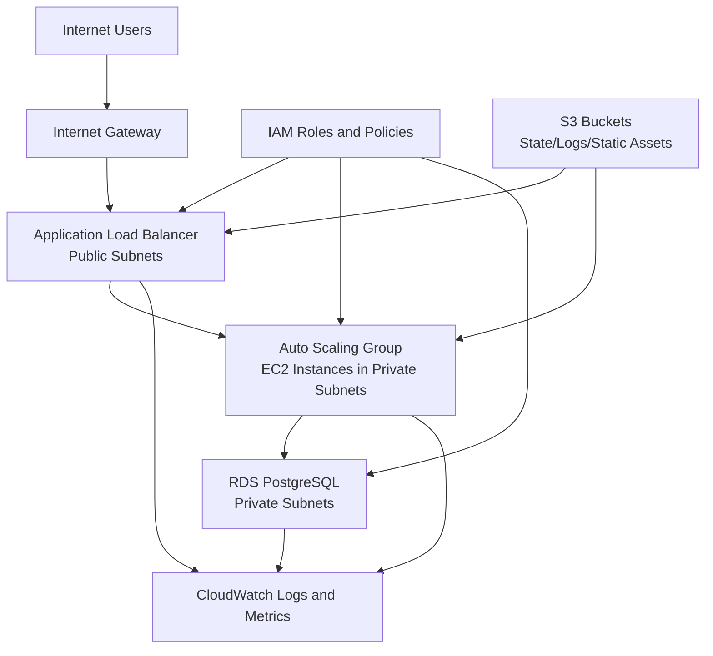

# AWS Architecture Overview

This document summarizes the project architecture by layer and how traffic flows through the stack.

## Diagram

## Layered Architecture

### Network
- VPC with public and private subnets across multiple Availability Zones.
- Internet-facing ALB is placed in public subnets.
- Application and database components run in private subnets.

### Compute
- EC2 instances run in an Auto Scaling Group behind the ALB.
- Health checks and scaling policies keep capacity aligned with demand.
- Instances are replaced automatically when unhealthy.

### Data
- PostgreSQL runs on Amazon RDS in private subnets.
- DB access is restricted to the application tier only.
- Backup and high-availability capabilities are designed for production patterns.

### Security
- Security Groups enforce least-privilege traffic between layers.
- IAM roles/policies provide scoped permissions for AWS services.
- No direct public access to database resources.

### Observability
- CloudWatch collects logs and metrics from infrastructure components.
- Monitoring supports health visibility and scaling decisions.
- Logging structure is ready for alarms and operational dashboards.
